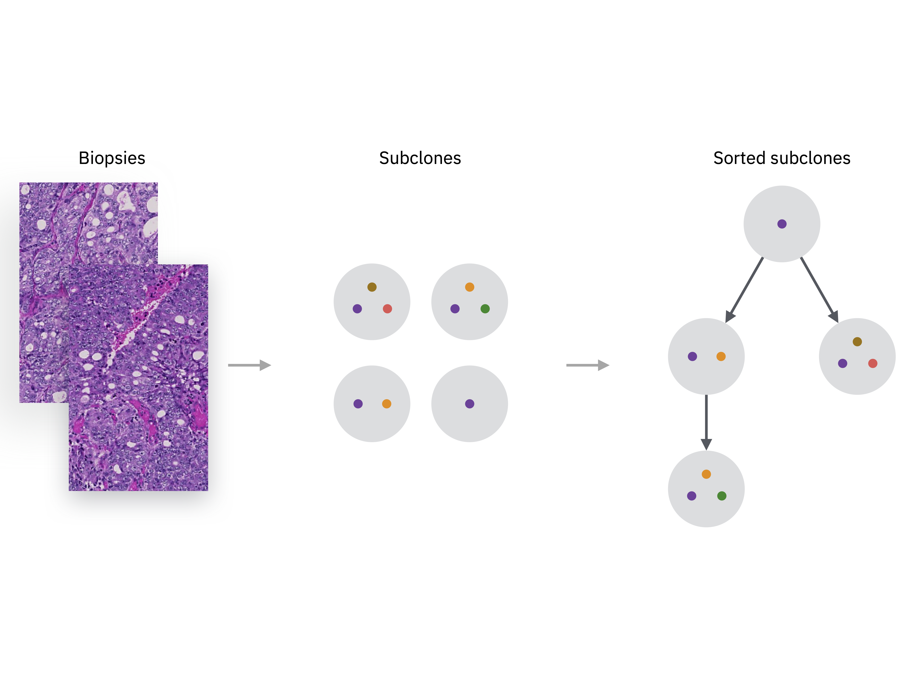

[](https://travis-ci.org/drugilsberg/chimaera)
[](https://zenodo.org/badge/latestdoi/176124980)

# chimaera



## References

Python implementation of Chimaera algorithm based on [Inferring clonal composition from multiple tumor biopsies](https://doi.org/10.1038/s41540-020-00147-5).

The supplementary tables for the publication can be found [here](https://bcm.box.com/v/chimaera-supplementary).

If you use Chimaera please cite it using the following:

```bibtex
@article{manica2020inferring,
  title={Inferring clonal composition from multiple tumor biopsies},
  author={Manica, Matteo and Kim, Hyunjae Ryan and Mathis, Roland and Chouvarine, Philippe and Rutishauser, Dorothea and Roditi, Laura De Vargas and Szalai, Bence and Wagner, Ulrich and Oehl, Kathrin and Saba, Karim and others},
  journal={NPJ systems biology and applications},
  volume={6},
  number={1},
  pages={1--13},
  year={2020},
  publisher={Nature Publishing Group}
}
```

## Requirements

- Python >=3.5
- pip >= 10.0

**NOTE:** For Python >=3.7 make sure `Cython` is installed before the installation of `chimaera`: `pip install Cython`.

## Installation

In case `pip` is installed just type:

```sh
pip install .
```

or directly from the repository.
Using ssh authentication:

```sh
pip install git+ssh://git@github.com/drugilsberg/chimaera
```

Using https:

```sh
pip install git+https://github.com/drugilsberg/chimaera.git
```

## Usage

Chimaera come with an excutable called `chimaera` that can be used as follows:

```sh
chimaera /path/to/data.txt
```

It accepts different arguments, read the help for a full description:

```console
usage: chimaera [-h] [--output-path OUTPUT_PATH]
                [--min-clone-size MIN_CLONE_SIZE]
                [--clone-analyzer CLONE_ANALYZER] [--input-sep SEP]
                [--allele-cn-lb DELTA_LB] [--allele-cn-ub DELTA_UB]
                [--log-file LOG_FILE] [--version]
                input_file

Run chimaera to estimate clonal composition of a tumor using multiple biosies
from a single patient.

positional arguments:
  input_file            File containing mutations data in tabular format. It
                        needs an header including VAF and CN fields(case-
                        insensitive) together with a sample-id, e.g.: id1-VAF
                        id1-CN ... idn-VAF idn-CN. An index containing the
                        mutations id is also required.

optional arguments:
  -h, --help            show this help message and exit
  --output-path OUTPUT_PATH
                        Path to directory where chimaera results should be
                        saved. If not passed it will print the output to
                        stdout (it can be used for piping commands).
  --min-clone-size MIN_CLONE_SIZE
                        Minimum number of mutations needed to consider a
                        clone. Default to 5.
  --clone-analyzer CLONE_ANALYZER
                        Clone analyzer used for optimizing clone frequencies.
                        Default to random. If robust is used it gives stable
                        estimates accross multiple run. Method random does not
                        underestimate frequencies but results are less
                        repeatable (~0.05-0.1 variability accross runs in
                        frequency estimates).
  --input-sep SEP       Field separator for input_file. Default to tab.
  --allele-cn-lb DELTA_LB
                        Allele copy number lower bound. Default to 0.0.
  --allele-cn-ub DELTA_UB
                        Allele copy number upper bound. Default to 4.0.
  --log-file LOG_FILE   File for logging chimaera output. Unless specified no
                        logging of chimaera execution is produced.
  --version, -v         chimaera version
```

## Example

See the file `data/exome_sample_data.txt` for an example of the input format.
Run the example:

```sh
chimaera data/exome_sample_data.txt
```

## web service deprecation

The Chimaera web-service has been deprecated in favour of the python package hosted in this repository.
Please check the examples to use Chimaera in your research.
